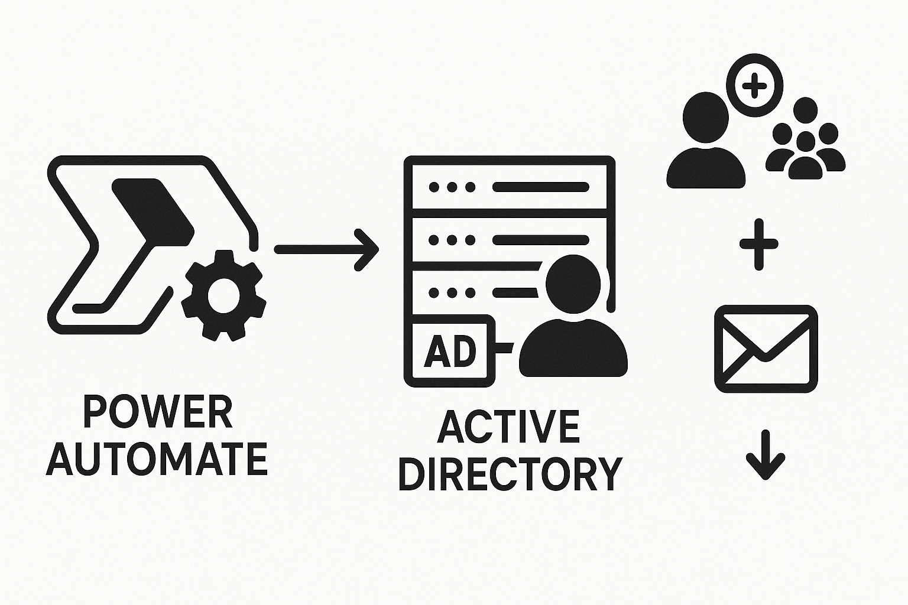
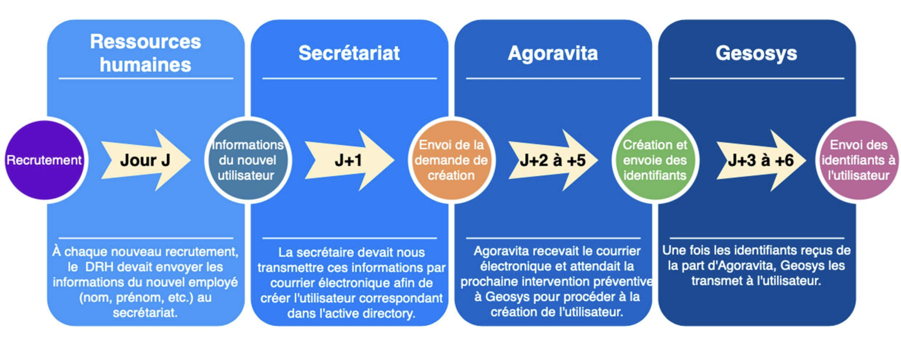
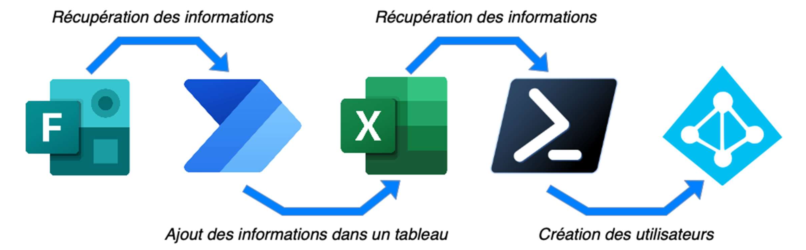

# | Active Directory + Power Automate |

# 🛠️ Automatisation de la Création des Comptes AD

Projet réalisé au sein de l'entreprise **Agoravita** pour le compte du client **Geosys**.

## 📌 Objectif

Automatiser la création des comptes utilisateurs Active Directory (AD) afin de :

- Réduire les délais de création (de J+6 à H+1).
- Éliminer la dépendance aux interventions d’Agoravita.
- Améliorer l’efficacité du processus d’onboarding des nouveaux collaborateurs.

---

## 🧰 Technologies utilisées

- **Microsoft Forms** : saisie des informations par les RH.
- **Power Automate** : déclenchement automatique du flux à la soumission du formulaire.
- **Excel Online (OneDrive)** : stockage temporaire des données utilisateur.
- **PowerShell** : création des comptes AD, attribution des groupes/licences, envoi du mot de passe.
- **Azure AD / Office 365** : synchronisation cloud et attribution de licences.

---

## 🔄 Fonctionnement du workflow

1. **Remplissage du formulaire** par la RH :
   - Nom / Prénom
   - Fonction
   - Groupe(s) de sécurité
   - Adresse email du manager
   - Licence O365 à attribuer

2. **Déclenchement du Flow Power Automate** :
   - Extraction des réponses
   - Ajout d’une ligne dans un fichier Excel sur OneDrive

3. **Script PowerShell planifié** :
   - Génère le compte AD (avec nom, SAM, UPN, email…)
   - Génère un mot de passe sécurisé
   - Attribue les groupes AD
   - Envoie le mot de passe au manager par email
   - Attribue la licence Office 365 via Azure AD

---

## 🔒 Sécurité

- Accès au formulaire restreint à certains membres internes.
- Utilisation de credentials sécurisés pour l’envoi d’email (fichier `.cred`).
- Vérification de l’existence du compte AD avant création.
- Droits appliqués automatiquement selon l’unité organisationnelle (OU).

---

## 📅 Automatisation

- Script PowerShell planifié via le **Task Scheduler** sur le serveur AD.
- Mise à jour continue du fichier Excel via OneDrive + Power Automate.

---

